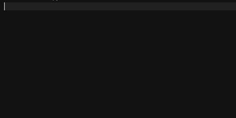
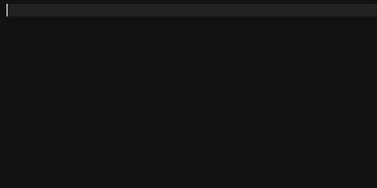
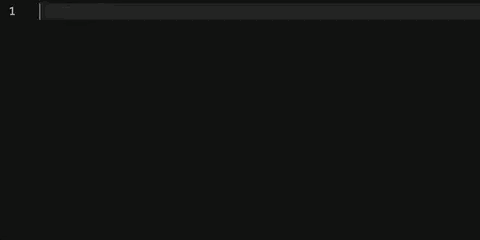
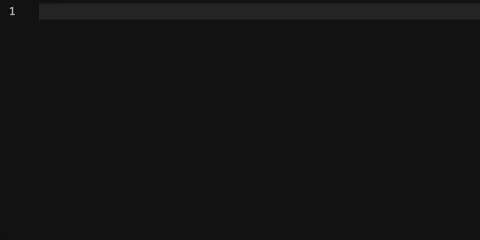
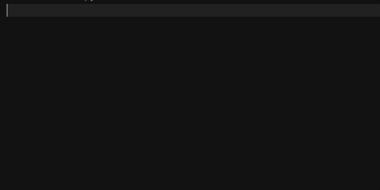
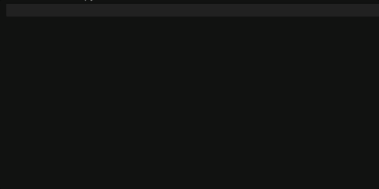
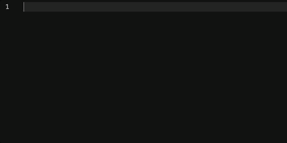
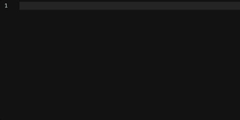

# ✨ Trailing Fun

> A colorful, gamified typing trail for VS Code. Make every keystroke feel alive.

---

## Features

**8 Visual Themes** — from a smooth Rainbow Wave to Matrix Rain, Burning Fire, and Neon Cyberpunk. Switch instantly from the status bar.

**💾 Smart Auto-Save** — automatically disables VS Code's `files.autoSave` while you type. Your file is saved **exactly once**, the moment the trail animation finishes. This means watching compilers (`tsc`, `webpack`, `npm watch`) are only triggered **once per typing burst** — not on every single keystroke.

**Autocomplete-Aware** — works seamlessly with GitHub Copilot and IntelliSense. Skips decoration on massive pastes to keep things clean.

**Zero Idle Overhead** — the animation engine is fully event-driven. It starts on your first keypress and stops itself automatically when you're not typing.

---

## Themes

| Theme | Preview | Description |
| :--- | :--- | :--- |
| 🎲 **Random Classic** |  | A different vibrant color for every character. |
| 🌈 **Rainbow Wave** |  | A smooth, shifting color spectrum. |
| 📌 **Fixed Color** |  | Your chosen hex color, consistently applied. |
| 🌟 **Glowing Aura** |  | Random colors with a soft cinematic glow. |
| ⚡ **Neon Cyberpunk** |  | Intense alternating pink and cyan neon. |
| 🔥 **Burning Fire** |  | Layered red, orange, and gold burn effect. |
| 👾 **Digital Glitch** |  | Jittery cyan/magenta chromatic corruption. |
| 📟 **Matrix Rain** |  | Classic green digital rain with a dark tint. |

### 🎨 Want more magic?
Have an idea for a theme? Whether it's **"Star Wars Hyperdrive"**, **"Retro Terminal"**, or something completely wild, I want to hear it! 

👉 [**Open a Theme Suggestion Issue**](https://github.com/isaaskin/trailing-fun/issues/new?title=Theme+Suggestion&body=I+would+love+to+see+a+theme+that...)

---

## Settings

| Setting | Default | Description |
| :--- | :--- | :--- |
| `trailing-fun.theme` | `classic` | Visual style for the trail. |
| `trailing-fun.fixedColor` | `#007acc` | Color used by the Fixed Color theme. |
| `trailing-fun.trailLength` | `12` | Number of fade steps (1–50). |
| `trailing-fun.trailSpeed` | `50` | Delay between each fade step in ms (10–500). Higher = slower fade. |
| `trailing-fun.smartAutoSave` | `true` | Manages `files.autoSave` to batch build triggers. |

---

## Commands

Access everything from the **✨ Fun** status bar item, or via the Command Palette:

- `Trailing Fun: Toggle` — enable or disable the trail.
- `Trailing Fun: Quick Config` — open the interactive theme and settings picker.

---

## Notes

- **Smart Auto-Save**: Enabled by default. When active, `files.autoSave` is temporarily set to `off` during typing and restored when you disable or uninstall the extension.
- **Performance**: The animation loop is fully idle-aware — no CPU or memory is used while you are not typing.
- **Ligatures**: If characters appear shifted in some themes, try disabling font ligatures for your editor font.

---

**Enjoy the magic!** 🪄
